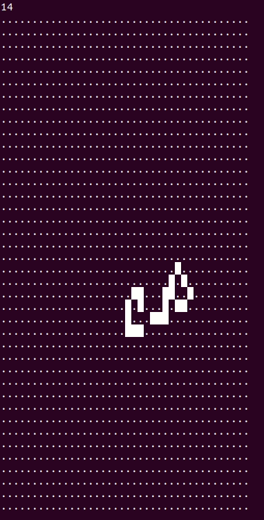
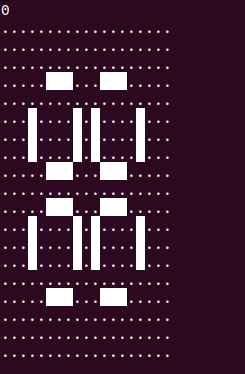

# Game of Life

C++ implementation of Conway's Game of Life, with OpenMP and MPI parallelization (TODO).

Examples:



## Status

[](https://github.com/apallath/GameOfLife/actions)
[](https://github.com/apallath/GameOfLife/issues)
[](https://github.com/apallath/GameOfLife/issues)

## Requirements
- [Boost C++ Libraries](https://www.boost.org/)

## Building from source
Generate makefiles and build using CMake by running the build bash script:

```sh
./build.sh
```

## Usage
To run a simulation:

```sh
./GameOfLife path/to/config/file
```

The program requires a configuration file to define options. For examples of configuration files, see the files in the
`examples/` directory.

## Testing
To run integration tests run

```sh
ctest
```

in the build directory.

To view test output, run ctest in verbose mode:

```sh
ctest -VV
```
